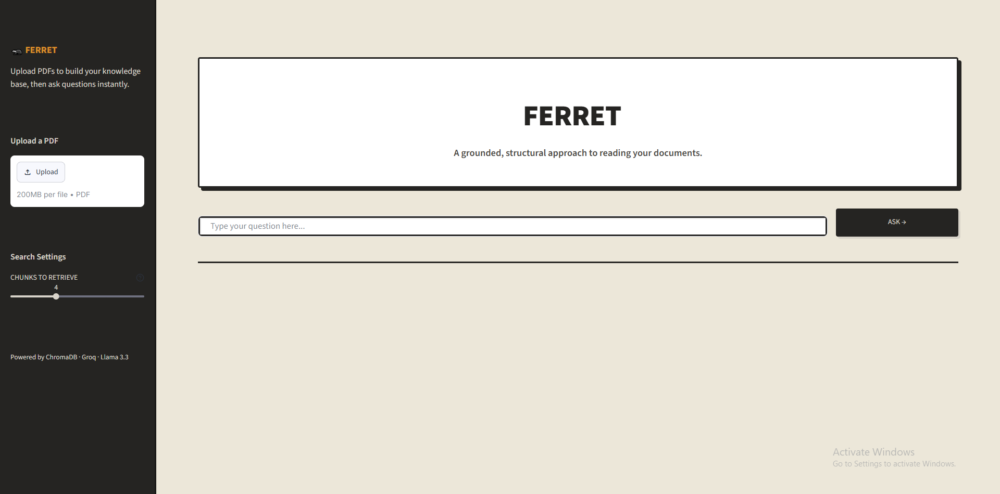

# Ferret

A small RAG app for asking questions about PDFs. You upload documents, and it answers using the text it finds in them, pointing back to where each answer came from.

It uses ChromaDB for retrieval and Llama 3.3 (through Groq) to write the answers. Embeddings run locally, so you only need an API key for the LLM.



## Setup

Install dependencies:

```bash
pip install -r requirements.txt
```

Add your Groq key to a `.env` file:

```
GROQ_API_KEY=your_key_here
```

## Running it

Start the API:

```bash
uvicorn main:app --reload
```

Then start the UI in another terminal:

```bash
streamlit run app.py
```

Upload a PDF from the sidebar and ask away.

## Without the UI

Index whatever PDFs are in `data/`:

```bash
python ingest.py
```

Ask a question from the command line:

```bash
python rag.py "what are the main findings?"
```

## Endpoints

- `POST /ask` — send a question, get back an answer and its sources
- `POST /upload` — upload a PDF and rebuild the index
- `GET /health` — health check

API docs are at `http://localhost:8000/docs` when the server is running.
